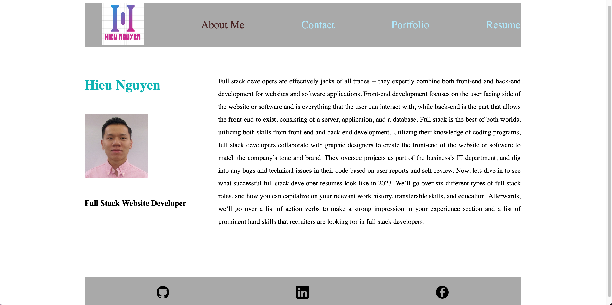

# React-Portfolio

## User Story

- As a developer, I want to build an professional portfolio so that I can instroduce myself to future employer and make myself standout.

## Description

- This application allows user to switch between tabs in navigation.

- The navigation bar contain About me page which is basic informatin about myself. 

- Contact me page will allow user to leave a message for me and email is check if vailded and message is require. 

- Portfolio page will allow user to see all of my repo on Github and on click will take them to that repo on Github. 

- Resume page will allow user to download my pdf resume and has information about my skills.

- Footer will contain icon of Github, LinkIn and Facebook on click will take them to the URL.

- This application was built with React only. 

## Usage

- Link to the deploy application : https://stately-dasik-adb3cb.netlify.app/#Resume

